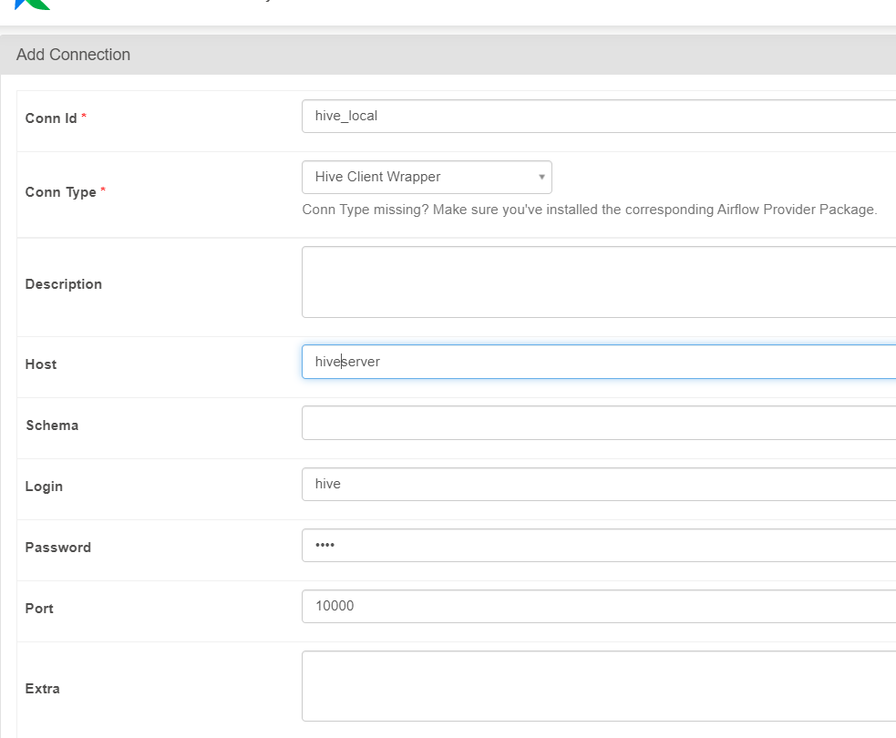

# COVID-19 Real-Time Big Data Pipeline

This repository showcases a real-time big data pipeline for COVID-19 data using modern big data tools and technologies. The pipeline demonstrates scalability, fault tolerance, and real-time data processing capabilities.

---

## Table of Contents

- [Overview](#overview)
- [Architecture](#architecture)
- [Technologies and Tools](#technologies-and-tools)
- [Setup Instructions](#setup-instructions)
- [Pipeline Steps](#pipeline-steps)
- [Customizations and Notes](#customizations-and-notes)
- [Acknowledgments](#acknowledgments)

---

## Overview

This project demonstrates the creation of a real-time scalable big data pipeline. The pipeline processes COVID-19 data to showcase the integration and capabilities of various big data technologies.

### Key Features:
- Real-time processing of COVID-19 data.
- Scalable and fault-tolerant architecture.
- Integration of Apache NiFi, Kafka, PySpark, HDFS, Hive, and Airflow.

---

## Architecture

1. **Data Ingestion**: Apache NiFi extracts and parses data before sending it to Kafka.
2. **Data Streaming**: Apache Kafka brokers the real-time data streams.
3. **Data Processing**: PySpark performs aggregations and transformations.
4. **Data Storage**: Processed data is stored in HDFS and queried using Hive.
5. **Workflow Orchestration**: Apache Airflow automates and monitors the entire pipeline.

---

## Technologies and Tools

- **Apache NiFi**: For data ingestion and preprocessing.
- **Apache Kafka**: For real-time stream processing.
- **Apache PySpark**: For aggregations and data transformations.
- **HDFS**: Distributed storage for processed data.
- **Apache Hive**: For querying and data warehousing.
- **Apache Airflow**: For workflow orchestration and automation.
- **Docker**: For containerizing all services.

---

## Setup Instructions

### Prerequisites

1. **AWS**: Having AWS account and good knowledge on EC2 and networking. 
2. **Custom Docker Images**:
   - Pull safe custom images from my Docker Hub:
     - `tezz4real`
     - `bde2020(BigDataEurope)`


### Steps

1. Clone this repository:
   ```bash
   git clone https://github.com/Tezz1999/Covid-19-Analysis.git
   cd Covid-19-Analysis

2. Set up and configure an EC2 instance to host the Docker-based cluster (refer to [configDocker.pdf](#)).

3. Use the provided `docker-compose.yml` file to spin up the required services:
   ```bash
   docker-compose up -d
4. Configure Airflow Connections:
Ensure that all necessary connections, such as the Hive connection, are configured in the Airflow UI.

## Pipeline Steps

### 1. NiFi - Data Ingestion
- Purpose: Fetches COVID-19 data from a snapshot stored on S3.
- Process:
    - Parses and publishes data to Kafka.
    - **Custom Data Quality Checks**: Use the EvaluateJsonPath processor to validate, clean, and transform data as needed.
### 2. Kafka - Data Streaming
- Purpose: Acts as the data broker for real-time streams. Feel free to create multiple 
- Process: Supplies data to PySpark for processing.

### 3. Pyspark - Data Processing 
- Purpose: Consumes data from Kafka and performs aggregations.
- Process:
  - Grouping by country.
  - Calculating total cases, recoveries, and deaths.
-  Output: Publishes processed data back to Kafka.
- Relevant File: test.py

### 4. HDFS and Hive - Data Storage
- Purpose: Stores processed data and enables querying.
- Process:
  - Saves processed data into HDFS.
  - Creates and populates Hive tables for reporting.
- Relevant Files:
  - hive_script.py
  - corana_data.hql

### 5. Airflow - Orchestration
- **Purpose:** Automates the execution of pipeline tasks.
- **Connections Required:**
  - Hive connection: Set this up in the Airflow UI.  
    
- **Initialization Script:** `airflow_init.sh`  
  This script creates the required folders (`dags`, `logs`, and `plugins`) for Airflow and initializes the environment for the pipeline.


## Customization 

### Custom Docker Images
- Docker Hub: tezz4real, bde2020

### COVID-19 API snapshot
- The data is sourced from an S3 snapshot since the official API has been deprecated.
- **Note:** Please avoid excessive querying of the snapshot to prevent misuse.


### Data Quality Checks
- Use NiFi's EvaluateJsonPath processor to add custom data quality parameters and transformations.
- For big data aggegations, groupby's and transformation use pyspark to read data from Kafka and write it back to Kafka consumer.

## 🚧 Project Status: Beta

This project is currently in **beta** and under active development. While the core functionalities are implemented and operational, there are ongoing efforts to enhance features, optimize performance, and improve scalability.

### Known Areas for Improvement:
- **Implementing Advanced Quality Metrics:** Enhance the pipeline to calculate and monitor comprehensive data quality metrics, ensuring accuracy, completeness, and reliability in real-time data streams.
- **Deep-Dive Real-Time Insights:** Extend data analysis capabilities to derive actionable insights, such as recovery rates and mortality rates for specific countries, leveraging real-time processing to deliver up-to-date information.
- **Building Real-Time Dashboards:** Develop interactive, real-time dashboards to visualize key performance indicators (KPIs), enabling users to monitor trends such as case progression, recovery rates, and other metrics at a glance.


### Contributing:
Feedback and contributions are welcome! Feel free to submit issues or pull requests to help improve this project.

> **Note:** As this project is still evolving, there might be breaking changes in the pipeline or configurations in future updates.

## Acknowledgments
Special thanks to:
- **Big Data Europe** for providing docker images for hadoop, Spark, and Hive.

This project is a demonstration of integrating and leveraging big data tools to create a robust, real-time pipeline. It is not a typical data analysis project but a showcase of scalable, fault-tolerant data engineering.

For questions or feedback, feel free to reach out via GitHub discussions.

